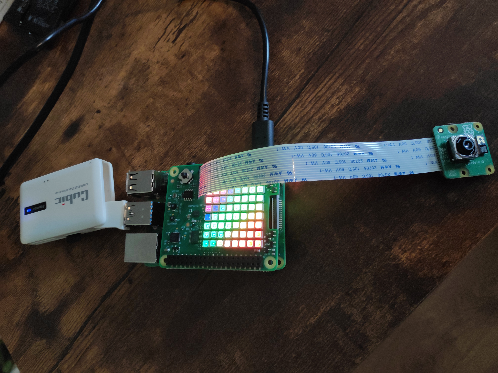
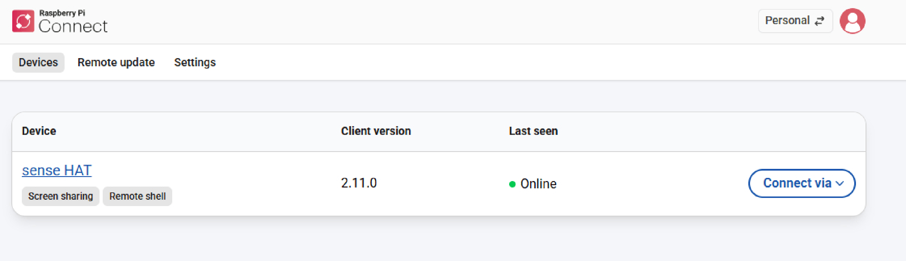
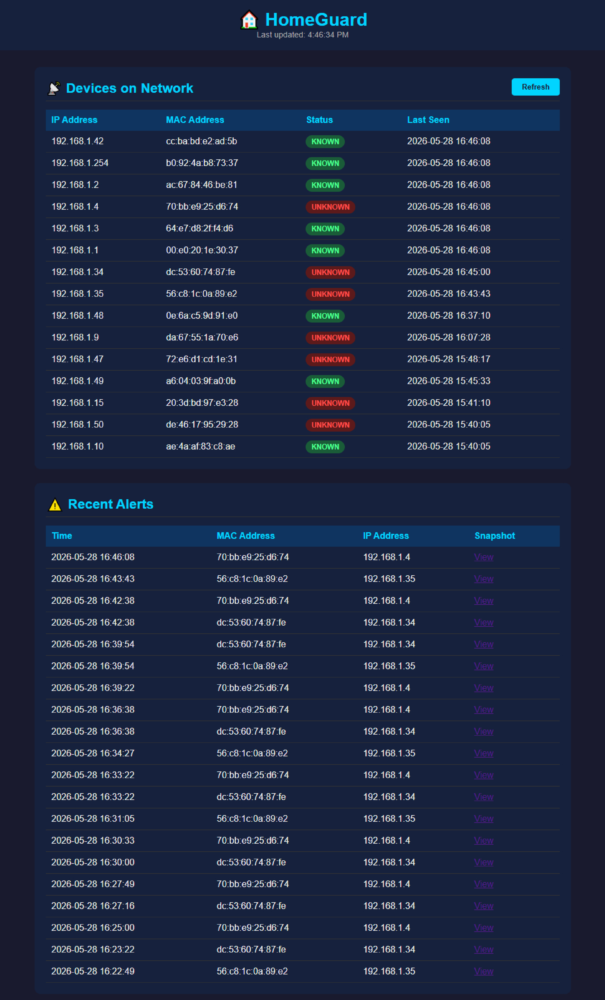
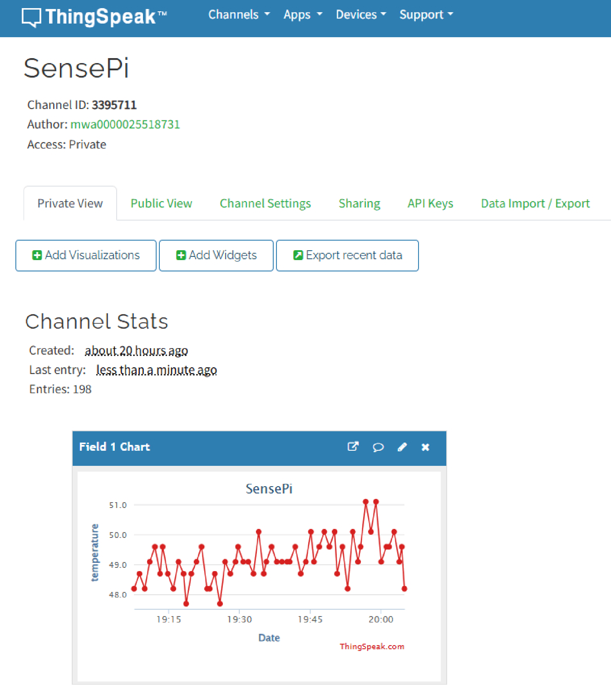
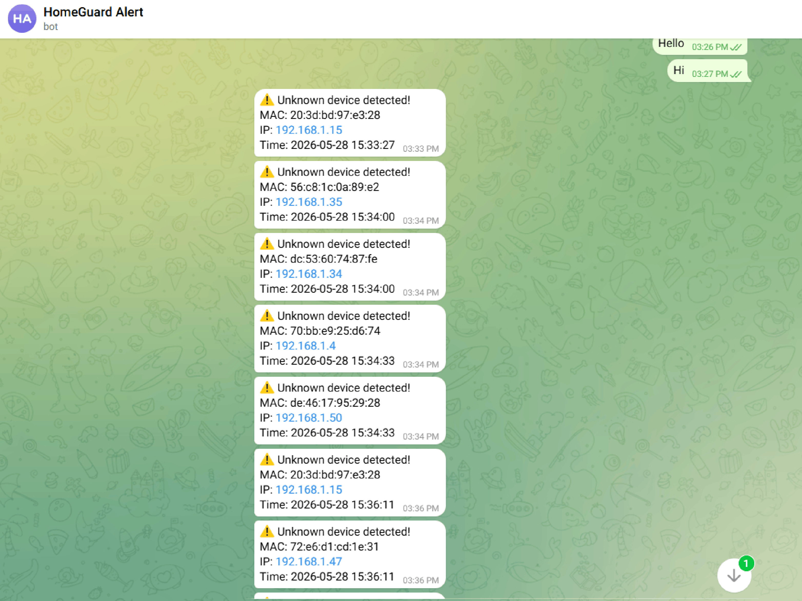

# HomeGuard 🏠

A Raspberry Pi-based home network monitoring system that detects unknown devices, captures snapshots, and sends real-time alerts.

## Features
- 📡 Scans home network every 30 seconds using ARP
- 🔍 Detects and flags unknown MAC addresses
- 📸 Captures camera snapshot when unknown device detected
- 🔴 SenseHAT LED matrix flashes red on alert (verified via terminal output)
- 📱 Sends Telegram notification to your phone
- 🌡️ Logs CPU temperature to ThingSpeak cloud
- 🗄️ Stores all events in SQLite database
- 🌐 Flask web dashboard accessible on local network
- ⚙️ Auto-starts on boot via systemd

## Hardware Required
- Raspberry Pi 4
- Raspberry Pi SenseHAT
- Raspberry Pi Camera Module 
- MicroSD card and power supply
- Home WiFi network

## Software Stack
| Component | Technology |
|-----------|------------|
| Web Framework | Flask (Python) |
| Database | SQLite |
| Network Scanning | Scapy (ARP) |
| Cloud Logging | ThingSpeak REST API |
| Alerts | Telegram Bot API |
| Hardware | SenseHAT, Picamera2 |
| OS Service | systemd |

## Quick Start
```bash
git clone https://github.com/your-username/HomeGuard.git
cd HomeGuard
python3 -m venv .venv
source .venv/bin/activate
pip install -r requirements.txt
cp .env.example .env
nano .env
sudo python3 app.py
```
Access dashboard at `http://<raspberry-pi-ip>:5000`


## Project Structure
```
HomeGuard/
├── app.py              # Main Flask application
├── requirements.txt    # Python dependencies
├── .env.example        # Example config
├── templates/
│   └── index.html      # Web dashboard
├── static/
│   └── snapshots/      # Camera snapshots
└── docs/
    └── installation_Guide.docx
```


## Screenshots

### Pi Setup


### Raspberry Pi Connect


### Camera Snapshot


### Dashboard


### ThingSpeak


### Telegram Alert



## Known Issues
- SenseHAT humidity/temperature sensor not detected (I2C issue)
- Workaround: CPU temperature used via vcgencmd measure_temp
- See docs/installation_Guide.docx for full details


## Learning Resources

### Raspberry Pi & Hardware
- [Raspberry Pi Official Documentation](https://www.raspberrypi.com/documentation/)
- [SenseHAT API Reference](https://sense-hat.readthedocs.io/en/latest/)
- [Picamera2 Documentation](https://datasheets.raspberrypi.com/camera/picamera2-manual.pdf)
- [Raspberry Pi Camera Guide](https://www.raspberrypi.com/documentation/accessories/camera.html)

### Python & Flask
- [Flask Official Documentation](https://flask.palletsprojects.com/)
- [Python SQLite3 Documentation](https://docs.python.org/3/library/sqlite3.html)
- [Python Threading Documentation](https://docs.python.org/3/library/threading.html)
- [Python dotenv Documentation](https://pypi.org/project/python-dotenv/)

### Networking & IoT
- [Scapy Documentation](https://scapy.readthedocs.io/en/latest/)
- [ARP Protocol Explained](https://www.fortinet.com/resources/cyberglossary/what-is-arp)
- [MAC Address Guide](https://www.howtogeek.com/764272/what-is-a-mac-address-and-how-does-it-work/)

### Cloud & Messaging
- [ThingSpeak Documentation](https://www.mathworks.com/help/thingspeak/)
- [Telegram Bot API Documentation](https://core.telegram.org/bots/api)
- [ThingSpeak REST API Guide](https://www.mathworks.com/help/thingspeak/rest-api.html)

### Tools Used
- [Git and GitHub Guide](https://docs.github.com/en/get-started)
- [systemd Service Guide](https://www.freedesktop.org/software/systemd/man/systemd.service.html)
- [SQLite Browser](https://sqlitebrowser.org/)


## Author
Boun Chun - HDip Computer Science — Computer Systems & Networks
