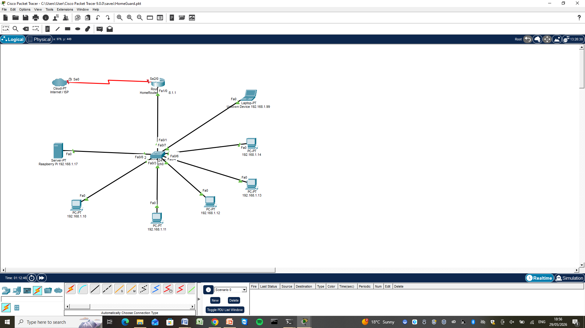
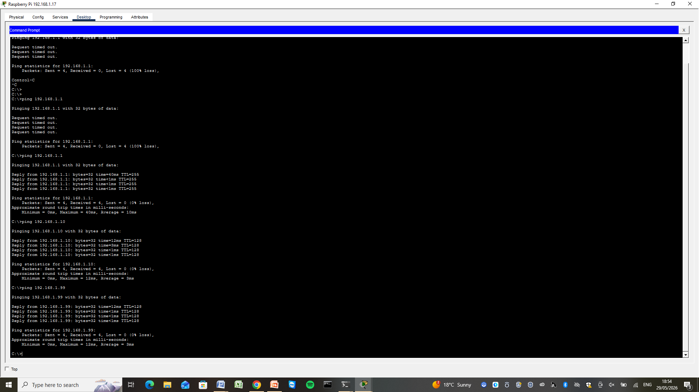

# HomeGuard 🏠

> 🌐 **Live Project Website:** [bounchun.github.io/HomeGuard](https://bounchun.github.io/HomeGuard/)

A Raspberry Pi-based home network monitoring system that detects unknown devices, captures snapshots, and sends real-time alerts.

## Features
- 📡 Scans home network every 30 seconds using ARP
- 🔍 Detects and flags unknown MAC addresses
- 📸 Captures camera snapshot when unknown device detected
- 🔴 SenseHAT LED matrix flashes red on alert (verified via terminal output)
- 📱 Sends Telegram notification to your phone
- 🌡️ Logs CPU temperature to ThingSpeak cloud
- 🗄️ Stores all events in SQLite database
- 🌐 Flask web dashboard accessible on local network
- ⚙️ Auto-starts on boot via systemd

## Hardware Required
- Raspberry Pi 4
- Raspberry Pi SenseHAT
- Raspberry Pi Camera Module 
- MicroSD card and power supply
- Home WiFi network

## Software Stack
| Component | Technology |
|-----------|------------|
| Web Framework | Flask (Python) |
| Database | SQLite |
| Network Scanning | Scapy (ARP) |
| Cloud Logging | ThingSpeak REST API |
| Alerts | Telegram Bot API |
| Hardware | SenseHAT, Picamera2 |
| OS Service | systemd |
| MQTT Broker | HiveMQ Cloud |
| MQTT Client | Paho MQTT (Python) |

| Method | Protocol | Destination | Data |
|---|---|---|---|
| REST | HTTP | ThingSpeak API | Temperature, device count, alert status |
| REST | HTTP | Telegram Bot API | Alert notifications with snapshot |
| MQTT | MQTT over TLS | HiveMQ Cloud | Full scan results (devices, unknown count, temperature) |

Every 30 seconds the scanner publishes to both REST endpoints and the MQTT broker simultaneously, demonstrating multiple communication methods.


## Quick Start
```bash
git clone https://github.com/your-username/HomeGuard.git
cd HomeGuard
python3 -m venv .venv
source .venv/bin/activate
pip install -r requirements.txt
cp .env.example .env
nano .env
sudo python3 app.py
```
Access dashboard at `http://<raspberry-pi-ip>:5000`


## Project Structure
```

HomeGuard/
├── app.py                  # Main Flask application
├── requirements.txt        # Python dependencies
├── .env.example            # Example config
├── index.html              # GitHub Pages website
├── templates/
│   └── index.html          # Web dashboard
├── static/
│   └── snapshots/          # Camera snapshots
└── docs/
    ├── installation_Guide.docx   # Full setup instructions
    ├── topology.png              # Packet Tracer network diagram
    └── ping-test.png             # Connectivity test results


```


## Screenshots

### Pi Setup


### Raspberry Pi Connect


### Camera Snapshot


### Dashboard


### ThingSpeak


### Telegram Alert


## Network Topology (Packet Tracer)

The HomeGuard network was designed and simulated in Cisco Packet Tracer before physical implementation, demonstrating the network architecture the Raspberry Pi operates within.

### Topology Diagram


| Device | IP Address | Role |
|---|---|---|
| HomeRouter | 192.168.1.1 | Default gateway |
| Raspberry Pi | 192.168.1.17 | Network scanner (HomeGuard) |
| PC1–PC5 | 192.168.1.10–.14 | Known/whitelisted devices |
| Laptop | 192.168.1.99 | Unknown/intruder device |

### Connectivity Test
The Raspberry Pi successfully pinged all devices on the network, confirming it can detect every device including the unknown intruder laptop — exactly how HomeGuard's ARP scanner works in production.



> Packets: Sent = 4, Received = 4, Lost = 0 (0% loss) for all devices


## Design Decisions

### Why ThingSpeak instead of Blynk
ThingSpeak is specifically designed for IoT data logging and visualisation
with REST API support — ideal for sending sensor readings from a Raspberry Pi.
Blynk is more suited for controlling hardware remotely (buttons, sliders) — HomeGuard is a monitoring
system, not a control system. ThingSpeak is also free for this use case without
requiring a paid plan.

### Why Telegram instead of Blynk notifications
Telegram Bot API is free with no message limits and easy to set up with just
a bot token and chat ID. It works on any device with Telegram installed.
Blynk notifications require a paid plan for production use and are tied to
the Blynk platform.

### Why GitHub Pages instead of Render or Cloudinary
GitHub Pages is free and permanently hosted, directly linked to the source
code repository with no separate deployment needed. Render is better suited
for hosting dynamic web apps with databases — HomeGuard's Flask dashboard
runs locally on the Pi, not on a server. Cloudinary is a media hosting
service, not relevant for a project website. GitHub Pages is simpler and
sufficient for a static project showcase website.

### Why MQTT alongside REST
MQTT is a lightweight publish/subscribe protocol designed for IoT devices — ideal for a Raspberry Pi sending frequent scan events. 
Unlike REST (request/response), MQTT decouples the publisher from subscribers, meaning any number of clients can receive scan data without the Pi knowing about them. 
HiveMQ Cloud was chosen as the broker for its free tier, TLS support, and reliable cloud infrastructure. 
Both MQTT and REST run in parallel — REST for cloud logging and alerts, MQTT for real-time event streaming.

## Known Issues
- SenseHAT humidity/temperature sensor not detected (I2C issue)
- Workaround: CPU temperature used via vcgencmd measure_temp
- See docs/installation_Guide.docx for full details


## Learning Resources

### Raspberry Pi & Hardware
- [Raspberry Pi Official Documentation](https://www.raspberrypi.com/documentation/)
- [SenseHAT API Reference](https://sense-hat.readthedocs.io/en/latest/)
- [Picamera2 Documentation](https://datasheets.raspberrypi.com/camera/picamera2-manual.pdf)
- [Raspberry Pi Camera Guide](https://www.raspberrypi.com/documentation/accessories/camera.html)

### Python & Flask
- [Flask Official Documentation](https://flask.palletsprojects.com/)
- [Python SQLite3 Documentation](https://docs.python.org/3/library/sqlite3.html)
- [Python Threading Documentation](https://docs.python.org/3/library/threading.html)
- [Python dotenv Documentation](https://pypi.org/project/python-dotenv/)

### Networking & IoT
- [Scapy Documentation](https://scapy.readthedocs.io/en/latest/)

### Cloud & Messaging
- [ThingSpeak Documentation](https://www.mathworks.com/help/thingspeak/)
- [Telegram Bot API Documentation](https://core.telegram.org/bots/api)
- [ThingSpeak REST API Guide](https://www.mathworks.com/help/thingspeak/rest-api.html)

### Tools Used
- [Git and GitHub Guide](https://docs.github.com/en/get-started)
- [systemd Service Guide](https://www.freedesktop.org/software/systemd/man/systemd.service.html)
  

## Author
Boun Chun - HDip Computer Science — Computer Systems & Networks
